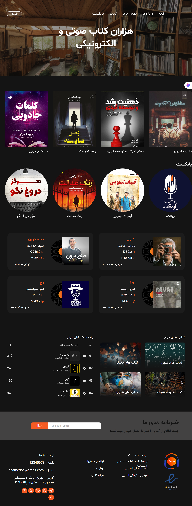
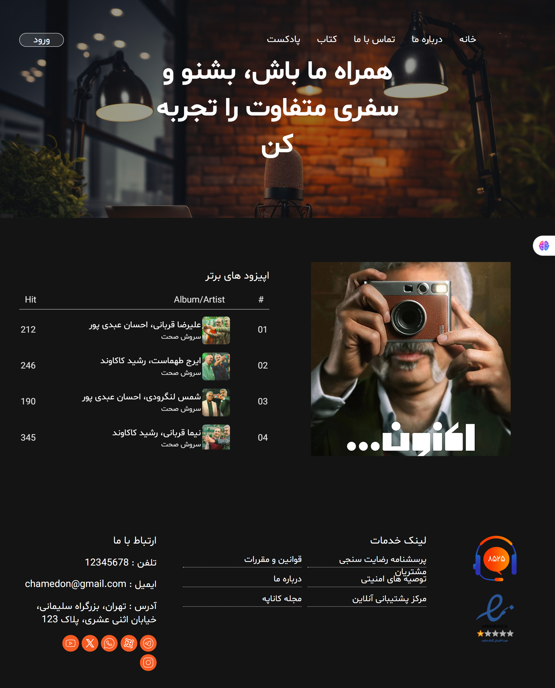
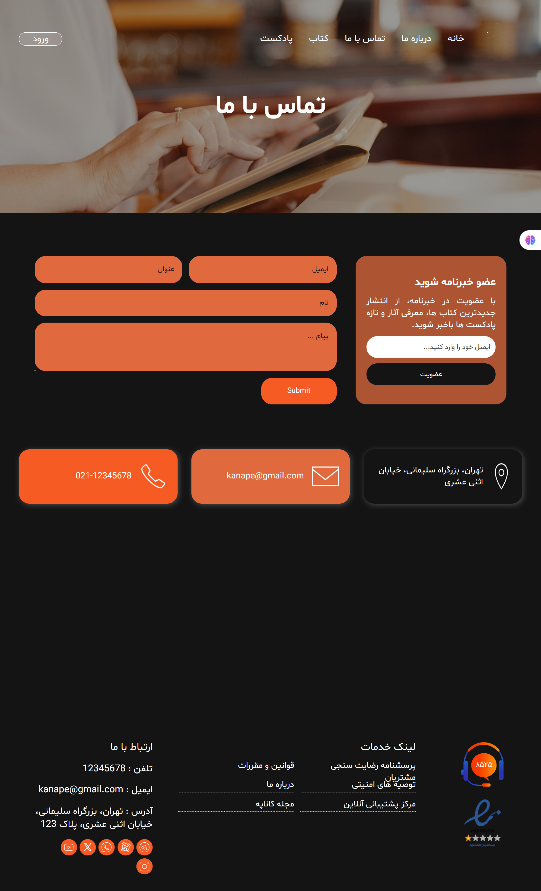

# 🛋️ Kanape

**Kanape** is a modern and responsive front-end website designed for book and podcast enthusiasts.  
The project focuses on creating an engaging user experience through interactive animations, a 360° virtual library, and a fully responsive interface optimized for different screen sizes.


---

## 📸 Screenshots

### Home Page


### Podcast Details


### Contactus Page


### Login Page


---

## ✨ Features

- 📚 Interactive 360° virtual library built with **Three.js** and **Panolens.js**
- 📱 - 📱 Fully responsive design for desktop, tablet, and mobile devices
- 🎨 Animated SVG logo with hover effects
- 📖 Horizontally scrollable books section
- 🎧 Horizontally scrollable podcasts section
- ❤️ Podcast cards displaying likes and information
- 🎙️ Dedicated podcast pages with episode lists
- 🏆 Top Books section categorized by genres
- 🎵 Top Podcasts playlist
- 📩 Newsletter subscription form
- 📍 Contact page with embedded Google Maps
- 👤 Responsive Sign Up page
- 🦶 Responsive footer

---

## 🛠️ Technologies Used

- HTML5
- CSS3
- SCSS (Sass)
- JavaScript (ES6)
- Three.js
- Panolens.js
- SVG Animation
- Responsive Web Design


---

## 📂 Project Structure

```text
.
├── assets
│   ├── home.png
│   ├── podcast-details.png
│   ├── contact.png
│   └── signup.png
├── css
├── js
├── images
├── index.html
└── README.md
```

---

## 🚀 Getting Started

1. Clone the repository.

```bash
git clone https://github.com/mohadesehkhani8686-dev
/kanape.git
```

2. Open the project in **Visual Studio Code**.

3. Run the project using **Live Server**.

> **Note:** Since this project uses **Three.js** and **Panolens.js**, it should be served through a local web server (such as Live Server). Opening the HTML file directly may prevent some assets from loading correctly.

---

## 📌 About

This project was developed as a front-end portfolio project to demonstrate responsive web design, modern UI development, animations, and interactive 3D web experiences.

---

## 👨‍💻 Author

Mohadeseh Khani
